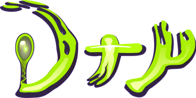

+   [![[**matrix**]](https://matrix.org/images/matrix-logo.svg)](https://matrix.to/#/#dry:matrix.org)

**Dry** – a bare bones fork of [**Urho3D**](https://urho3d.github.io/) – is a FOSS cross-platform 2D and 3D game engine implemented in C++

If you are using QtCreator, the [Dry wizards](https://gitlab.com/luckeyproductions/drywizards) can be used to create projects and classes.

## [Documentation](https://dry.luckey.games)

Primary sections:  

-  [Building Dry](https://dry.luckey.games/_building.html)
-  [Using Dry](https://dry.luckey.games/_using_library.html)

To generate documentation yourself into the "Docs" subdirectory, open the   Doxyfile in the
"Docs" subdirectory with doxywizard and click "Run doxygen" from the "Run" tab.
Get Doxygen from http://www.doxygen.org & Graphviz from http://www.graphviz.org.
See section "Documentation build" below on how to automate documentation
generation as part of the build process.

-----

Urho3D was greatly inspired by [OGRE](http://www.ogre3d.org) and [Horde3D](http://www.horde3d.org). Additional inspiration & research used:

- [Rectangle packing](https://clb.demon.fi/projects/rectangle-bin-packing) by Jukka Jylänki (clb)
- [Tangent generation](https://www.terathon.com/code/tangent.html) from Terathon
- [Fast, Minimum Storage Ray/Triangle Intersection](https://www.graphics.cornell.edu/pubs/1997/MT97.pdf) by Möller & Trumbore
- [Linear-Speed Vertex Cache Optimisation](https://home.comcast.net/~tom_forsyth/papers/fast_vert_cache_opt.html) by Tom Forsyth
- Software rasterization of triangles based on Chris Hecker's
  [Perspective Texture Mapping](https://chrishecker.com/Miscellaneous_Technical_Articles) series in the Game Developer magazine
- [Networked Physics](https://gafferongames.com/game-physics/networked-physics/) by Glenn Fiedler
- [Euler Angle Formulas](https://www.geometrictools.com/Documentation/EulerAngles.pdf) by David Eberly
- [Red Black Trees](https://eternallyconfuzzled.com/tuts/datastructures/jsw_tut_rbtree.aspx) by Julienne Walker
- [Comparison of several sorting algorithms](https://warp.povusers.org/SortComparison/) by Juha Nieminen

Dry also uses the following third-party libraries:

- [AngelScript](http://www.angelcode.com/angelscript) 2.33.0+
- [Boost](http://www.boost.org) 1.64.0 - only used for AngelScript generic bindings
- [Box2D](http://box2d.org) 2.3.2 WIP
- [Bullet](http://www.bulletphysics.org) 2.86.1
- [Civetweb](https://github.com/civetweb/civetweb) 1.7
- [FreeType](https://www.freetype.org) 2.8
- [GLEW](http://glew.sourceforge.net) 1.13.0
- [SLikeNet] (https://github.com/SLikeSoft/SLikeNet)
- [libcpuid](https://github.com/anrieff/libcpuid) 0.4.0+
- [LZ4](https://github.com/lz4/lz4) 1.7.5
- [MojoShader](https://icculus.org/mojoshader)
- [Mustache](https://mustache.github.io, https://github.com/kainjow/Mustache) 1.0
- [nanodbc](https://lexicalunit.github.io/nanodbc) 2.12.4+
- [Open Asset Import Library](http://assimp.sourceforge.net) 4.1.0
- [pugixml](http://pugixml.org) 1.7
- [rapidjson](https://github.com/miloyip/rapidjson) 1.1.0
- [Recast/Detour](https://github.com/recastnavigation/recastnavigation)
- [SDL](https://www.libsdl.org) 2.0.10+
- [SQLite](https://www.sqlite.org) 3.20.1
- [StanHull](https://codesuppository.blogspot.com/2006/03/john-ratcliffs-code-suppository-blog.html)
- [stb_image](https://nothings.org) 2.18
- [stb_image_write](https://nothings.org) 1.08
- [stb_rect_pack](https://nothings.org) 0.11
- [stb_vorbis](https://nothings.org) 1.13b
- [WebP](https://chromium.googlesource.com/webm/libwebp)
- [ETCPACK](https://github.com/Ericsson/ETCPACK)

DXT / PVRTC decompression code based on the Squish library and the Oolong
Engine.  
Ninja model and terrain, water, smoke, flare and status bar textures from OGRE.  
BlueHighway font from Larabie Fonts.  
Anonymous Pro font by Mark Simonson.  
NinjaSnowWar sounds by Veli-Pekka Tätilä.  
PBR textures from [Substance Share](https://share.allegorithmic.com).  
IBL textures from HDRLab's sIBL Archive.  
Dieselpunk Moto model by allexandr007.  
 Mud Leaves and Grass Rock textures from [Poly Haven](https://polyhaven.com/textures).  
License / copyright information included with the assets as necessary. All other assets (including shaders) by Urho3D or Dry authors and licensed similarly as the engine itself.

